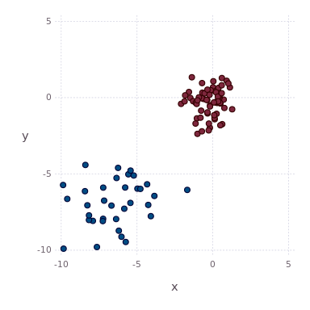

BayesianNonparametrics.jl
===========
BayesianNonparametrics.jl is a Julia package implementing state-of-the-art Bayesian nonparametric models for medium-sized unsupervised problems. The software package brings Bayesian nonparametrics to non-specialists allowing the widespread use of Bayesian nonparametric models. Emphasis is put on consistency, performance and ease of use allowing easy access to Bayesian nonparametric models inside Julia.

BayesianNonparametrics.jl allows you to

- explain discrete or continous data using: Dirichlet Process Mixtures or Hierarchical Dirichlet Process Mixtures
- analyse variable dependencies using: Variable Clustering Model
- fit multivariate or univariate distributions for discrete or continous data with conjugate priors
- compute point estimtates of Dirichlet Process Mixtures posterior samples

Installation
------------
You can clone the package into your running julia installation using

```julia
Pkg.clone("https://github.com/OFAI/BayesianNonparametrics.jl.git")
```

Documentation
-------------
Documentation is available on readthedocs: 
[http://bnpjl.readthedocs.org/en/latest/](http://bnpjl.readthedocs.org/en/latest/)

Example
-------
The following example illustrates the use of BayesianNonparametrics.jl for clustering of continuous observations using a Dirichlet Process Mixture of Gaussians. 

After loading the package:

```julia
using BayesianNonparametrics
```

we can generate a 2D synthetic dataset (or use a multivariate continuous dataset of interest)

```julia
(X, Y) = bloobs(randomize = false)
```

and construct the parameters of our base distribution:

```julia
μ0 = vec(mean(X, 1))
κ0 = 5.0
ν0 = 9.0
Σ0 = cov(X)
H = WishartGaussian(μ0, κ0, ν0, Σ0)
```

After defining the base distribution we can specify the model:

```julia
model = DPM(H)
```

which is in this case a Dirichlet Process Mixture. Each model has to be initialised, one possible initialisation approach for Dirichlet Process Mixtures is a k-Means initialisation:

```julia
modelBuffer = init(X, model, KMeansInitialisation(k = 10))
```

The resulting buffer object can now be used to apply posterior inference on the model given $X$. In the following we apply Gibbs sampling for 500 iterations without burn in or thining:

```julia
models = train(modelBuffer, DPMHyperparam(), Gibbs(maxiter = 500))
```

You shoud see the progress of the sampling process in the command line. After applying Gibbs sampling, it is possible explore the posterior based on their posterior densities,

```julia
densities = Float64[m.energy for m in models]
```

number of active components

```julia
activeComponents = Int[sum(m.weights .> 0) for m in models]
```

or the groupings of the observations:

```julia
assignments = [m.assignments for m in models]
```

The following animation illustrates posterior samples obtained by a Dirichlet Process Mixture: 


Alternatively, one can compute a point estimate based on the posterior similarity matrix:

```julia
A = reduce(hcat, assignments)
(N, D) = size(X)
PSM = ones(N, N)
M = size(A, 2)
for i in 1:N
  for j in 1:i-1
    PSM[i, j] = sum(A[i,:] .== A[j,:]) / M
    PSM[j, i] = PSM[i, j]
  end
end
```

and find the optimal partition which minimizes the lower bound of the variation of information:

```julia
mink = minimum([length(m.weights) for m in models])
maxk = maximum([length(m.weights) for m in models])
(peassignments, _) = pointestimate(PSM, method = :average, mink = mink, maxk = maxk)
```

The grouping wich minimizes the lower bound of the variation of information is illustrated in the following image:


[](https://travis-ci.org/trappmartin/BayesianNonparametrics.jl)

[](https://coveralls.io/github/trappmartin/BayesianNonparametrics.jl?branch=master)

[](http://codecov.io/github/trappmartin/BayesianNonparametrics.jl?branch=master)
